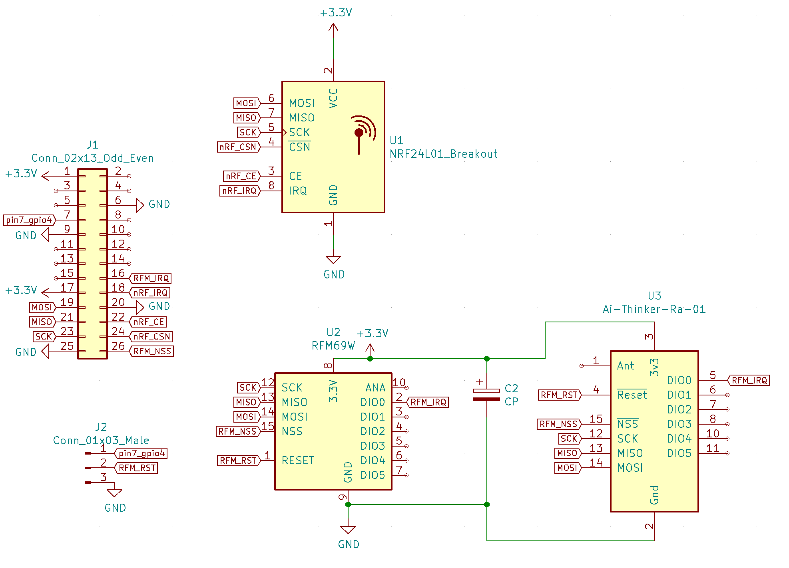

## Simple installation and compilation of MySensors gateway
Modify MQTT_HOST in `install.sh`
 
And run ```bash install.sh```

### SensorBender PiGate Pins
| rPI | BCM | PiGate |
| :----: | :---: | :----|
| **nRF24** |
|  15  |  24  |  nRF24 IRQ  |
|  22  |  25  |  nRF24 CE |
|  24  |  8  |  nRF24 CS |
| **RFM95** |
|  13  |  23  |  RFM95 IRQ (DIO0) |
|  26  |  7  |  RFM95 CS  |
| **Common** |
|  19  |  10  |  MOSI  |
|  21  |  9  |  MISO  |
|  23  |  11  |  SCK   |

# Schema

